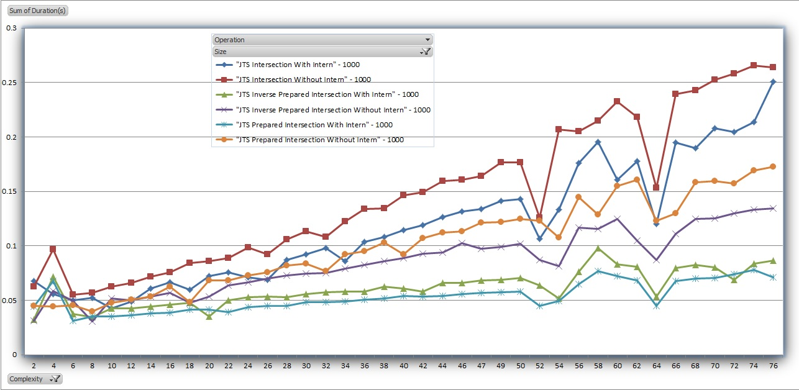
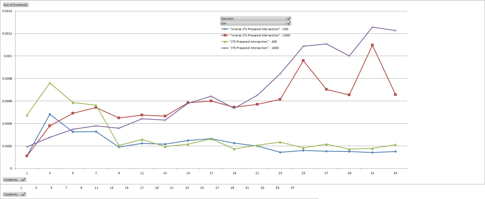

# Benchmark Tools

**com.robertson.geobench.GeoBenchmark**:  compare prepared vs. non prepared JTS geometry operations (e.g. intersection).    Output hard-coded to geo_bench_out.csv.
 
**com.robertson.geobench.GeoInternedBenchmark**: compare interned prepared and non prepared JTS geometry with some overhead for maintaining the interned image.
Prepared Geomerties do not implement Object.hashCode(), thus a separated wrapper image is maintained. Furthermore, to measure the overhead of construction,
the geometry is maintained in byte[] array (as the key).   Output hard-coded to geo_interned_bench_out.csv.
 
**com.robertson.geobench.GeoBenchmarkWithShape**: create benchmarks for comparing random sets of geometries to geometries in the shape file.  This can be used to measure
the performance between different granularities of a specific shape.

## Test

The benchmark looks through all combinations of complexity and size parameters.  Complexity and size start atone1 and continue up to and including the provided maximum for each parameter.
The test involes performing a set of operations (e.g. intersection) between a driving shape and a comparison shape.  There is a single driving shape and a group of comparison shapes.
The size of the group is determined by the size parameter.  The complexity (number of vertices) of the driving shape is determined by the complexity parameter.  All comparison
shapes have one hundred vertices.   
 
Comparison geometries represent a set of geometries.  The driving geometry represents a query shape.
 
At the moment, the number of sample runs is hard coded to five.  The results for each operation is an average of the results over the sample runs.

## Parameters

* **Complexity**: The complexity of the single driving shape compared to a group of shapess.  The amount of vertices in the driving shape is the complexity times ten.
* **Size**:  Determines the number of shapes in the comparison group is 500 * the iteration size.
* **Operations**: The set of operations to perform.

## Operations

Currently, only intersection operations are being benchmarked.
 
There are two categories of operations, those that started with a byte encoded geometries and those that start with instantiated Geometries.
 
The operations used thus far test both the utilization of interning and the best possibile use of a **prepared** geometry.  The prepared geometry is a type of index for improving
performance of geometric operations.  There is an associated cost for instantiating the prepared geometry for a given geometry.  Prepared geometries may provide different performance
characteristics depending on the complexity of the underlying drivibg geometry and the geometry to which a comparison is being made.   Inverse comparison involve preparing the comparison instead of the driving geometry.

## Earlier Work

Early versions inspected memory consumption when using interning vs. non-interning.  As can be expected, interning the association between byte encoded geometry and a geometry(prepared or otherwise),
reduces the memory footprint.  Thus, the memory analysis is excluded from this latest version.  
 
The use of the byte encoding serves two purposes.  First, prepared geometries cannot be interned since they do not implement hashCode().  Interning a prepared geometry
requires interning a wrapper instance that implements hashCode().  The wrapper could implement hashCode() and equals() using underlying geometry. In these tests, the wrapper implements hashCode() and equals() 
on the byte encoding of the associated geometry. Second, the primary use of this approach being tested is within data in which geometries are encoded.  Using this approach, the decoding step can be skipped when an interned representation associated
with a geometry or prepared geometry already exists. 

## Sample Run
<pre>
mvn clean compile
mvn exec:exec
</pre>

## GeoInternedBenchmark

With five hundred comparison shapes, interned prepared geometries ("JTS Prepared Intersection With Intern") perform consistently better across most levels of complexity tested.  
Interned geometries where the comparison geometry is prepared ("JTS Inverse Prepared Intersection With Intern") performed nearly as well.  The act of preparing a geometry of limited complexity
incurs very little overhead compared to gains from its use.  The use of interning, alone provides significant value.   When removing interning ("JTS Prepared Intersection Without Intern" and "JTS Inverse Prepared Intersection Without Intern",  preparing the comparison geometry performs better than
preparing the driving geometry.  Part of the reason is the time spent reconstructing the driving geometry.  The benefit of preparation is measured when comparing across interning tests. 
"JTS Inverse Intersection With Intern" and "JTS Inverse Intersection With Intern" both perform worse than their prepared counterparts.

##GeoBenchmark

The graph below shows the results of the three operations between a geometry over increasing complexity with a comparison set of 200 and 1000 geometries, each with ten vertices.
The graph results indicate that performance is increased when preparing the less complex geometry of the two, with the exception of line strings and single points (complexity two and one, respectively).

